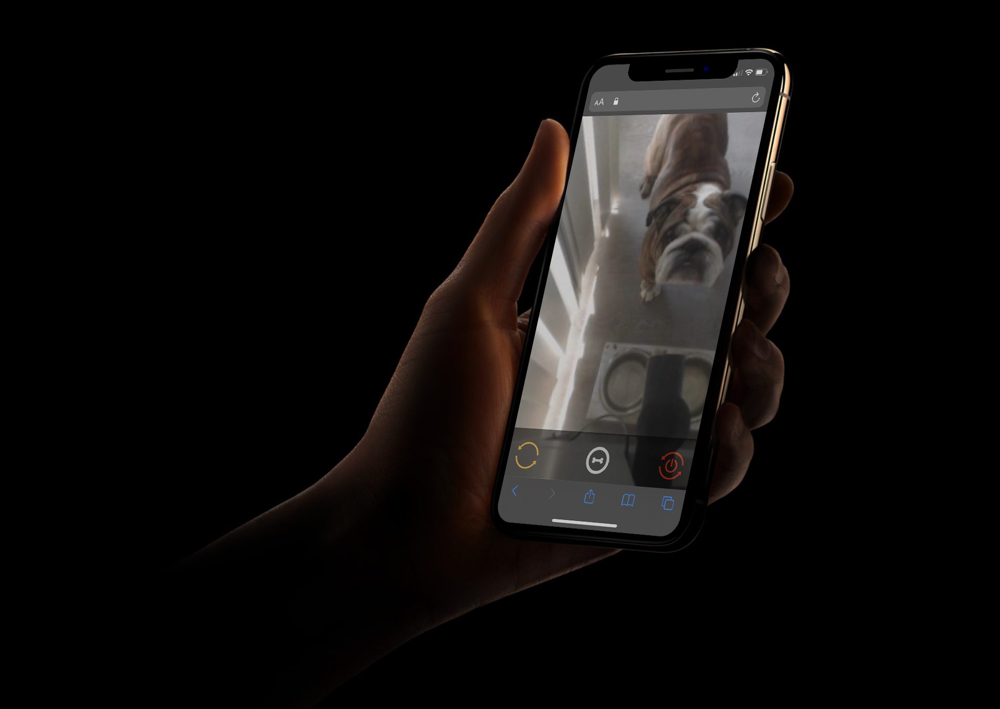

<h1 align="center">
  
</h1>

OpenTreat allows you to view and interact with your pets while not at home. 

Watch a live video stream of your pet from your smartphone or laptop, and remotely dispense treats with the push of a button.

This a complete rewrite of my original OpenTreat project found [here](https://github.com/Un1xG0d/OpenTreat).

## Overview
The treat dispenser system is built using a Raspberry Pi and 3D printed parts. When a user presses the button on the web app, it turns the servo motor for a certain number of seconds. This spins the middle piece and dispenses a section of treats into the bowl below.

## Parts needed
* Raspberry Pi
* SG90 servo (any 360* servo motor should work)
* USB webcam
* 3D printer

## Physical assembly
1. Download and 3D print each STL listed in the `models` folder
	1. The recommended print settings are in the Resources section below
2. Assemble the parts using super glue
3. Hook up the 3 servo wires to the Raspberry Pi’s GPIO pins

## Device setup
1. Image your Raspberry Pi with [Raspbian](https://www.raspberrypi.com/software/)
2. Create a new user with the username `admin`
3. Configure your WiFi network settings
4. Enable OpenSSH

## Download the code
```
git clone https://github.com/Un1xG0d/OpenTreat2.git ~/OpenTreat
cd ~/OpenTreat
```

## Install dependencies
```
sudo pip3 install -r requirements.txt
```

## Set up username and password
The web app uses HTTP Basic Auth to secure the video feed.

Create a `.env` file in the root directory and update the values accordingly:
```
USERNAME=test
PASSWORD=test
```

This will be your username & password to login to the web app.

## Automatic startup
Create a cronjob with `sudo crontab -e` to automatically set up and start the web app on boot.

```
@reboot /home/admin/OpenTreat/boot.sh
```

## Port forward the app
Make sure to change your router settings to allow a port forward of port 3000 to your Raspberry Pi. This is what makes the web app accessible to the internet.

## View the video stream
On your smartphone or laptop, browse to your router's external IP on port 3000 to view the video stream of your pets. 
Press the bone button to drop treats into your pets' bowl.

## Resources
### Recommended print settings
> Scale: 80%  
> Infill: 10%  
> Layer Height: 0.2  
> Speed: Standard  
> Supports: None

### RPi GPIO pinout
> Red wire - Pin 1 - 3v3 power  
> Black wire - Pin 6 - ground  
> Orange wire - Pin 11 - GPIO 17  

## Screenshots & proof-of-concept

